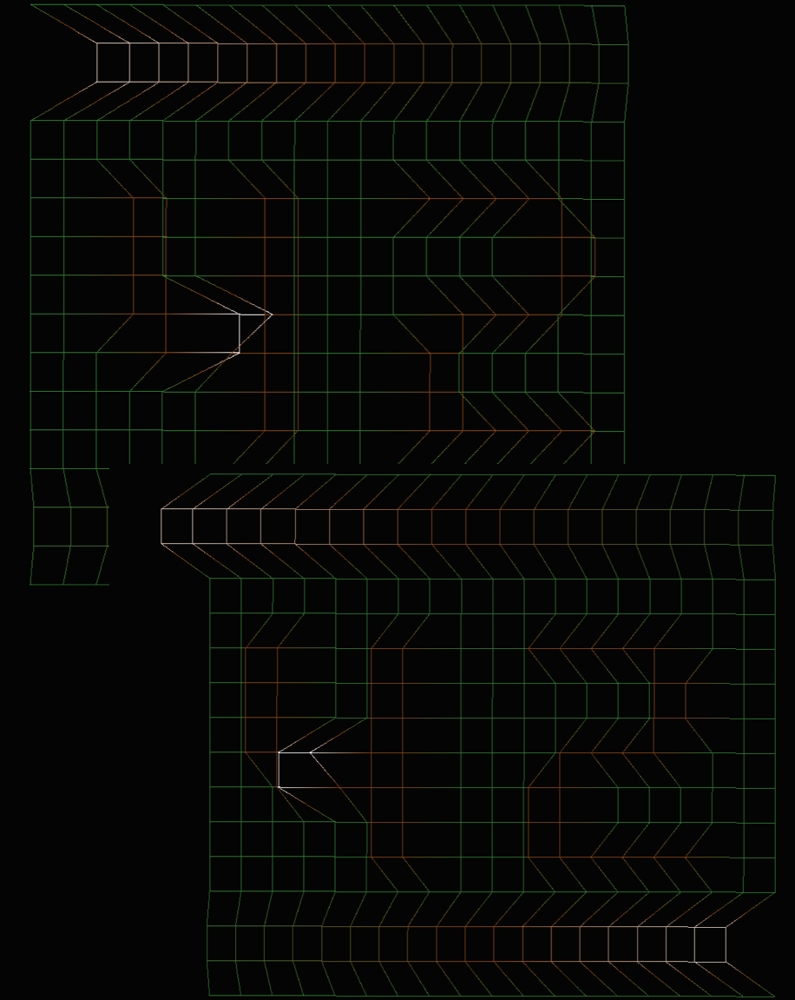

# Project #4 fdf (Wire-frame), Nov 2014
>>>>> #####Read a given file and draw its geometrical representation.

#####Grade ``(125/100)`` ``(125/125)*``
--------  -----------------------
Goals:
- [X] Open a given file and read a grid out of it. ([Exemple](https://github.com/Ngoguey42/proj04_graph_fdf/blob/master/42.fdf))
- [X] Use "minilibX", school's truncated version of "X11".
- [X] ESC quits the program.

Recommended bonuses:
- [X] Three colors gradient, depending on the elevation of a point.
- [X] Read colors in arguments.
- [ ] Handle hidden faces.
- [ ] Multiple projections.
 
My additions:
- [X] Movements in the 3d plane. **W/S**:"Move Forward/Backward", **Q/E**:"Strafe Left/Right", **A/D**:"Turn Left/Right" **UP/DOWN**:"Look Up/Down".
- [X] Balanced movements while multiple keys are pressed. ([movements.c](https://github.com/Ngoguey42/proj04_graph_fdf/blob/master/movements.c))
- [X] Time dependant movements, instead of CPU dependant. ([events.c](https://github.com/Ngoguey42/proj04_graph_fdf/blob/master/events.c)) ([libft/srcs/ft_clock[...].c](https://github.com/Ngoguey42/proj04_graph_fdf/tree/master/libft/srcs))
- [X] One, two or three colors read in arguments.

Use: (colors in RGB decimal):
```sh
./fdf file.fdf ["R1 G1 B1[;R2 G2 B2[;R3 G3 B3]]"]
```


<br><br><br><br><br><br><br><br>


```
All my C files strictly observes school's norm, it may often lead to odd or illogical syntaxes.
- [ ] Forbiden keywords: for, do, switch, goto.
- [ ] No more than 25 lines inside a function block.
- [ ] No more than 80 characters per lines.
- [ ] At most 5 functions per files.
- [ ] Only 1 declaration per line.  
- [ ] No declaration and assignation on the same line.
- [ ] At most 1 assignation per line.
- [ ] No more than 4 parameters for a function.
- [ ] No nested ternary.
- [ ] Comments alowed at the top of the file.
```
```
*
- A grade of 85 was required to validate the project.
- A maximum grade of 125 was reachable.
- Second sessions are organised for failed projects.
```
